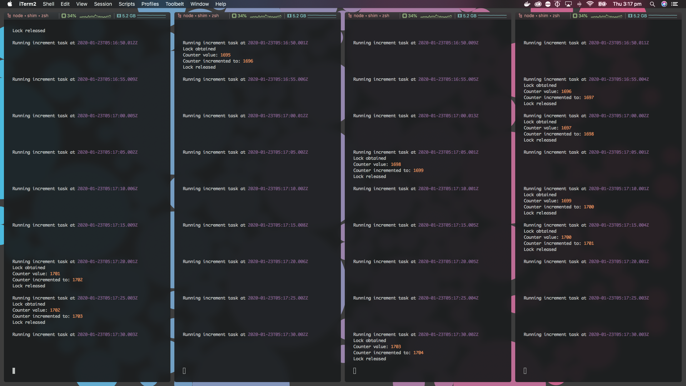

# MongoDB Lock Demo
A very rudimentary lock demo for MongoDB & Mongoose, for when you have multiple threads/processes that shouldn't do the same thing at the same time.

## TL;DR
A **Lock** schema is defined in `schema/Lock.js`.
* Locks consist of a `name` (unique identifier) and an `owner` (e.g. process id)
* Use `Lock.obtain(name, owner)` to obtain a lock instance, or `null` if it's already owned
* Release an instance with `lock.release()` so it can be obtained again

## In depth
The **Lock** schema only allows one process or thread of a program to "own" a given **lock instance** at a time. A lock should be obtained before processes/threads attempt to run tasks that shouldn't happen concurrently:

```js
const Lock = require('./schema/Lock.js')
const LOCK_NAME = 'myLock'

// Create the lock
async function init() {
	await Lock.create({ name: LOCK_NAME })
}

// Elsewhere ...
async function someImportantTask() {
	// Try and obtain the lock
	const lock = await Lock.obtain(LOCK_NAME, process.pid)

	// Check if we obtained the lock
	if (lock) {
		try {
			// ... do stuff here
		} finally {
			// Release the lock when we're done
			await lock.release()
		}
	}
}
```

Attempting to obtain a lock instance first checks if it already has an owner. If not, the lock's owner is set and the lock instance is returned. Other instances/threads will now receive a null value when trying to obtain the lock until its owner releases it.

Lock instances also have an inbuilt expiry to ensure that crashed processes/threads can't hold onto them forever. By default, any lock that has been claimed for more than 30 seconds can be claimed by a new owner. This expiry is set immediately after a lock is claimed.

## Onto the demo
This demo simply increments a counter once every 5 seconds using [node-schedule](https://www.npmjs.com/package/node-schedule). Make sure you have a MongoDB instance running, then run the demo in a few terminals at once. The counter should only ever increment once every time the cron is run, regardless of how many instances of the demo are running concurrently.


